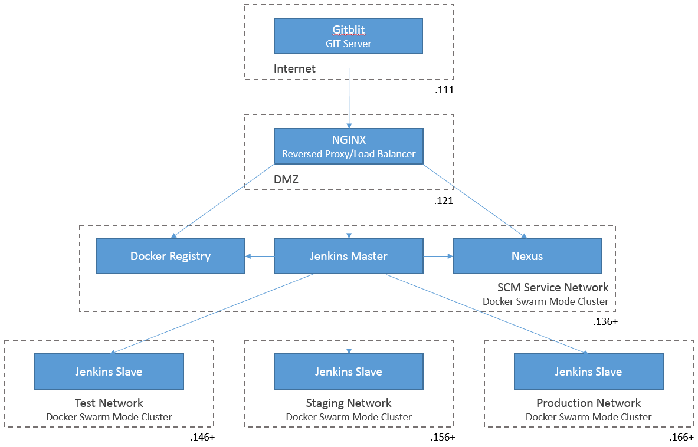

# Introduction

This project showcases provisioning a fully automated setup of a working SCM environment including:

 * All components Dockerized
 * All SCM components clustered (Docker swarm mode)
 * GIT server Gitblit deployed in a network context representing the Internet
 * NGINX reversed proxy and load balancer deployed in a network context representing a DMZ
 * Docker Registry server deployed in an SCM service network
 * Jenkins Master server deployed in the SCM service network
 * Sonatype Nexus Repository OSS server deployed in the SCM service network
 * Jenkins Slave clients deployed in 3 network contexts representing a test, staging and production environment
 * CI/CD examples based on Go and Spring Boot projects

After successful initial provisioning the environment will look like this:



## Credits

This project was able to build and extend upon project [cd-demo](https://github.com/krasi-georgiev/cd-demo), so many thanks to [Krasi Georgiev](https://github.com/krasi-georgiev). Also a lot of appreciation goes towards the developers of Jenkins, Gitblit, Sonatype Nexus and NGINX.


# Installation & Usage

## Pre-requisites

To successfully deploy the showcase environment, you require:

 * at a minimum 8 GB of memory available to the Docker hosts
   keep in mind your docker-machine/VirtualBox host also requires available memory
 * a recent version of VirtualBox installed: tested with 5.0.36_Ubuntu r114008
 * a recent version of Docker Machine installed: tested with version 0.10.0, build 76ed2a6
 * Docker Machine running on Ubuntu 16.04 LTS (Linux Mint 18 Sarah)
 * Docker v17.03.0-ce or higher
 * environment set according content of `setenv.sh`
 * commands "vboxmanage" and "vboxwebsrv" are in your path

Add the following entries to your `/etc/hosts` file:

```bash
192.168.99.111  int gitblit
192.168.99.121  dmz lb jenkins nexus
192.168.99.136  scm registry
192.168.99.146  test
192.168.99.156  staging
192.168.99.166  production
```

## Installation

There are 4 top level scripts that orchestrate the following use cases:

 * create-all.sh  
   provisions all components through execution of the following steps:
   * create the keys and certificates for the certificate authority (CA) and Docker registry  
     (you are requested to enter a passphrase and repeat it several times)
   * starts the VirtualBox web service exposing access to volumes shared in swarm mode clusters
   * create the Virtual machines for the Docker hosts (a.o. including setting static IPs and installing REX-Ray volume driver)
   * create the shared volumes and provision initial content for Jenkins Master
   * construct the swarm mode clusters
   * create overlay networks
   * deploy Docker Registry service
   * build Jenkins slave image and publish to our Docker Registry
   * deploy Jenkins Master service
   * deploy Jenkins Slave services
   * deploy Nexus service including configuration of our repositories (public, releases and snapshots)
   * optionally deploy Portainer services
   * deploy Docker container hosting Gitblit
   * create GIT repositories, commit example sources to master and create development branches  
   * deploy Docker container hosting NGINX

 * remove-all.sh  
   removes all of the components created above.

 * stop-all.sh  
   stop all of the components created above facilitating later restart. Data is persisted in the volumes.
   
 * start-all.sh  
   start all of the components as earlier created.

## Configuration

The following environment variables have to be set:

| Variable Name | Description |
| ------------- | ------------|
| `SCM_DOCKER_1_APPL_DIR` | <b>The root directory of the application elements</b><br/>Points to the directory into which you have cloned this repository. |
| `SCM_DOCKER_1_DATA_DIR` | <b>The root directory of the data elements</b><br/>Underneath this directory VirtualBox volumes and certificates will be stored. |
| `AMOUNT_OF_HOSTS_PER_CLUSTER` | <b>The amount of Docker hosts in the swarm mode clusters</b>.<br/> Depending on the availability of memory in your system, you can increase or decrease the size of nodes in the swarm mode clusters by adjusting the value assigned to this environment variable. |

Examples are provided in the script `setenv.sh`.

## Access

The following credentials are set initally:

| Application | URL | Userid | Password |
| ----------- | --- | ------ | -------- |
| Gitblit | http://gitblit:8081/ | admin | admin |
| Nexus | http://dmz/nexus/ | admin | admin123 |
| Jenkins | http://dmz/jenkins/ | admin | admin123 |
| Registry | https://registry:5000/ | admin | admin123 |
| Portainer<br/>(optional) | http://scm:8084/#/dashboard</br>http://test:8084/#/dashboard</br>http://staging:8084/#/dashboard</br>http://production:8084/#/dashboard | <i>unset</i> | <i>unset</i> |

## Known Issues

When SCM services refuse to start and remain in the `Pending` state for deployment on the 2nd swarm node, this is caused by Docker not detecting the volumes or REX-Ray driver. To resolve this execute commands:

```bash
eval $(docker-machine env swarm-scm-1)
docker volume ls
```

# Todo

The following tasks are on the wish list of this project:

 * Real network segregation and isolation with firewall configuration
 * Use Weave (network) and Flocker (volumes)
 * Configure and use our Nexus 3 instance as a Docker Registry
 * Docker Registry access configured through NGINX (using Reverse Proxy feature)
 * All images as used in showcase available from local Docker Registry
 * Make all credentials configurable and specify GIT remote without password in URL
 * Add LDAP service and delegate authentication/authorization concerns
 * Move all services exposed through HTTP to HTTPS
 * Use provisioning tooling instead of bash scripts (Ansible?)

Any ideas or thoughts on the direction of this project are welcome.

License
=======
Copyright (c) 2017 Jaden McKey

Code released under the MIT License.

